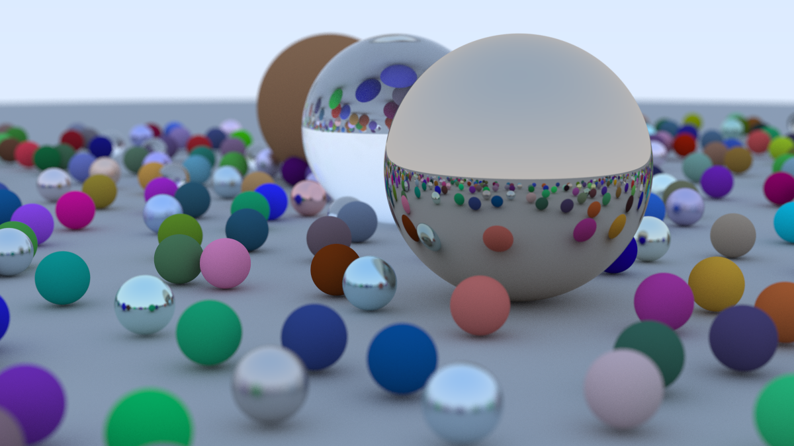
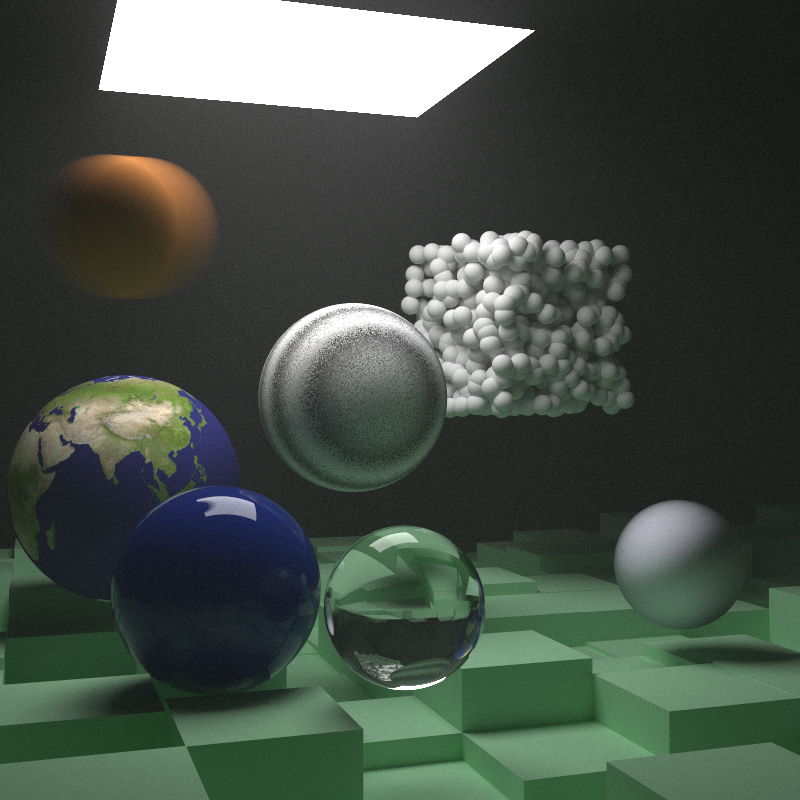
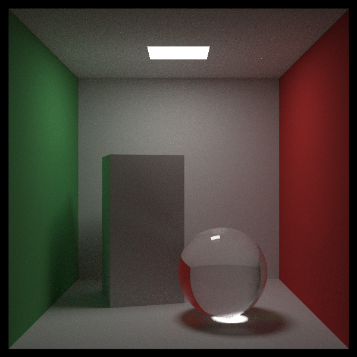

# raytracing_rs
Implementation of the Raytracing in a Day/Week/Lifetime series in Rust

## References:
- [Day](https://raytracing.github.io/books/RayTracingInOneWeekend.html)
- [Week](https://raytracing.github.io/books/RayTracingTheNextWeek.html)
- [Lifetime](https://raytracing.github.io/books/RayTracingTheRestOfYourLife.html)

## Final Images

